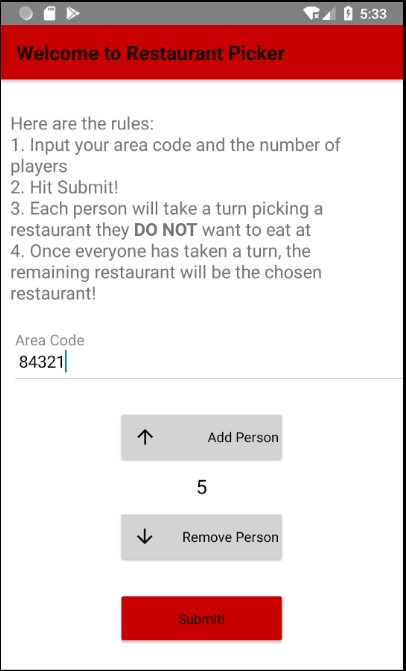
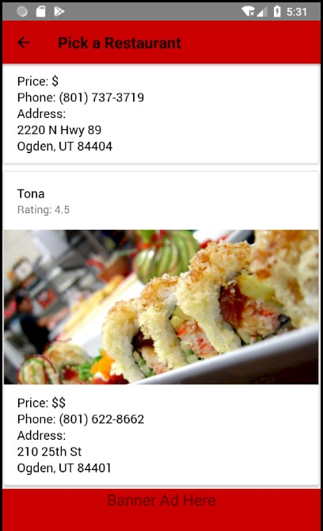
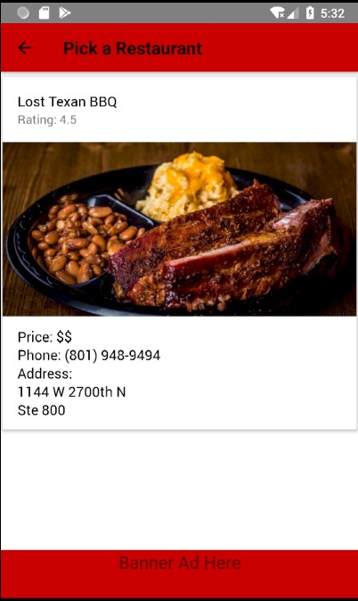

# Restaurant Picker

This is a project for MIS5700.

The idea behind this app is that when with a group of people, there are so many places to eat out that no group can decide on one place.
This problem is solved by our app. You enter where you are and how many people are in you group and the app will generate restaurants.

The members of you group then go through and touch whichever restaurant that they don't want to eat at.

This guarantees that the restaurants that is chosen will not be someones last pick.

